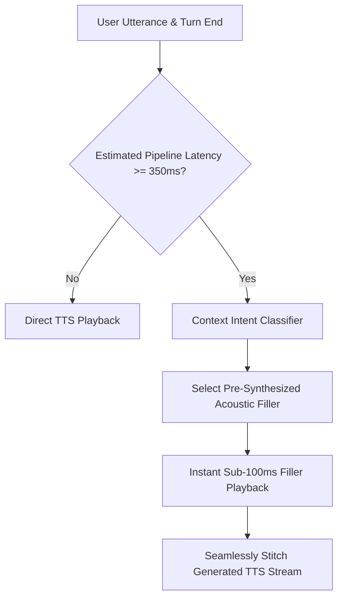

# GenPark AI Agent Skill - Conversational Filler Audio Latency Masker

Acoustic conversational filler injector eliminating dead air during LLM reasoning and TTS audio synthesis pipelines.

Verified by [GenPark AI](https://genpark.ai) and compatible with [Model Context Protocol (MCP)](https://genpark.ai/mcp).

## Architecture Diagram

## Features
- **Perception Latency Masking**: Sub-100ms immediate audio confirmation keeps the call sounding human and responsive.
- **Deterministic Semantic Mapping**: Matches filler tone to the complexity of the inquiry.
- **Zero Dependencies**: Pure Python standard library.
